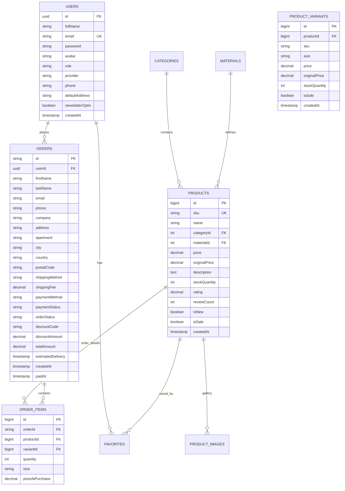

# Database Schema Design - VELMORA (Final Sync)

Bản thiết kế này đã được hiệu chỉnh để đạt độ chính xác 100%, khớp từng ô nhập liệu trên giao diện và từng trường trong mã nguồn.

## 1. Sơ đồ quan hệ (ERD)

## 2. Chi tiết 9 Bảng dữ liệu (Khớp 100% yêu cầu)

### Bảng 1: Users (Người dùng)
| Trường | Kiểu dữ liệu | Mô tả |
| :--- | :--- | :--- |
| `id` | UUID | Khóa chính |
| `fullName` | VARCHAR | Họ và tên hiển thị |
| `email` | VARCHAR | Email đăng nhập/liên lạc |
| `password` | VARCHAR | Mật khẩu mã hóa |
| `avatar` | TEXT | URL ảnh đại diện |
| `role` | VARCHAR | customer / admin |
| `provider` | VARCHAR | email / google |
| `phone` | VARCHAR | Số điện thoại |
| `defaultAddress` | TEXT | Địa chỉ mặc định |
| `newsletterOptin` | BOOLEAN | Đăng ký nhận tin |
| `createdAt` | TIMESTAMP | Ngày tham gia |

### Bảng 2: Categories (Danh mục)
| Trường | Kiểu dữ liệu | Mô tả |
| :--- | :--- | :--- |
| `id` | INT | Khóa chính |
| `slug` | VARCHAR | Đường dẫn thân thiện |
| `name` | VARCHAR | Tên tiếng Việt (Nhẫn, Dây chuyền) |
| `imageUrl` | TEXT | Ảnh đại diện danh mục |

### Bảng 3: Materials (Chất liệu)
| Trường | Kiểu dữ liệu | Mô tả |
| :--- | :--- | :--- |
| `id` | INT | Khóa chính |
| `slug` | VARCHAR | gold, silver, diamond |
| `name` | VARCHAR | Tên hiển thị |

### Bảng 4: Products (Sản phẩm)
| Trường | Kiểu dữ liệu | Mô tả |
| :--- | :--- | :--- |
| `id` | BIGINT | Khóa chính |
| `sku` | VARCHAR | Mã định danh (VEL-001) |
| `name` | VARCHAR | Tên sản phẩm |
| `categoryId` | INT | FK sang bảng Categories |
| `materialId` | INT | FK sang bảng Materials |
| `price` | DECIMAL | Giá tham khảo / giá khởi điểm |
| `originalPrice` | DECIMAL | Giá gốc tham khảo |
| `description` | TEXT | Mô tả chi tiết |
| `stockQuantity` | INT | Số lượng trong kho tổng |
| `rating` | DECIMAL | Điểm đánh giá trung bình |
| `reviewCount` | INT | Tổng số lượt đánh giá |
| `isNew` | BOOLEAN | Sản phẩm mới |
| `isSale` | BOOLEAN | Có chương trình giảm giá |
| `createdAt` | TIMESTAMP | Ngày tạo |

### Bảng 5: ProductVariants (Biến thể sản phẩm)
| Trường | Kiểu dữ liệu | Mô tả |
| :--- | :--- | :--- |
| `id` | BIGINT | Khóa chính |
| `productId` | BIGINT | FK sang bảng Products |
| `sku` | VARCHAR | Mã SKU riêng cho biến thể |
| `size` | VARCHAR | Kích thước hoặc biến thể |
| `price` | DECIMAL | Giá của biến thể này |
| `originalPrice` | DECIMAL | Giá gốc của biến thể |
| `stockQuantity` | INT | Số lượng trong kho theo biến thể |
| `isSale` | BOOLEAN | Biến thể đang giảm giá |
| `createdAt` | TIMESTAMP | Ngày tạo |

### Bảng 6: ProductImages (Hình ảnh)
| Trường | Kiểu dữ liệu | Mô tả |
| :--- | :--- | :--- |
| `id` | BIGINT | Khóa chính |
| `productId` | BIGINT | FK sang bảng Products |
| `url` | TEXT | Đường dẫn ảnh |
| `isMain` | BOOLEAN | Ảnh chính hiển thị ở Card |
| `displayOrder` | INT | Thứ tự trong Gallery |

### Bảng 7: Orders (Đơn hàng)
| Trường | Kiểu dữ liệu | Mô tả |
| :--- | :--- | :--- |
| `id` | VARCHAR | Mã đơn (ORD-XXXXXX) |
| `userId` | UUID | FK sang bảng Users |
| `firstName` | VARCHAR | Tên người nhận |
| `lastName` | VARCHAR | Họ người nhận |
| `email` | VARCHAR | Email nhận thông báo |
| `phone` | VARCHAR | SĐT nhận hàng |
| `company` | VARCHAR | Tên công ty (Tùy chọn) |
| `address` | TEXT | Địa chỉ chính |
| `apartment` | VARCHAR | Căn hộ, tòa nhà, số phòng |
| `city` | VARCHAR | Thành phố |
| `country` | VARCHAR | Quốc gia |
| `postalCode` | VARCHAR | Mã bưu chính |
| `shippingMethod` | VARCHAR | standard, express, free |
| `shippingFee` | DECIMAL | Phí vận chuyển |
| `paymentMethod` | VARCHAR | vnpay, momo, credit-card... |
| `paymentStatus` | VARCHAR | unpaid, paid |
| `orderStatus` | VARCHAR | Trạng thái xử lý |
| `discountCode` | VARCHAR | Mã giảm giá đã áp dụng |
| `discountAmount` | DECIMAL | Số tiền giảm giá |
| `totalAmount` | DECIMAL | Tổng tiền đơn hàng |
| `estimatedDelivery` | TIMESTAMP | Thời gian dự kiến giao |
| `createdAt` | TIMESTAMP | Thời gian đặt hàng |
| `paidAt` | TIMESTAMP | Thời gian thanh toán |

### Bảng 8: OrderItems (Chi tiết đơn hàng)
| Trường | Kiểu dữ liệu | Mô tả |
| :--- | :--- | :--- |
| `id` | BIGINT | Khóa chính |
| `orderId` | VARCHAR | FK sang bảng Orders |
| `productId` | BIGINT | FK sang bảng Products |
| `variantId` | BIGINT | FK sang bảng ProductVariants |
| `quantity` | INT | Số lượng mua |
| `size` | VARCHAR | Kích thước / biến thể đã chọn |
| `priceAtPurchase` | DECIMAL | Giá lúc mua (Snapshot) |

### Bảng 9: Favorites (Yêu thích)
| Trường | Kiểu dữ liệu | Mô tả |
| :--- | :--- | :--- |
| `userId` | UUID | FK sang bảng Users |
| `productId` | BIGINT | FK sang bảng Products |

---
