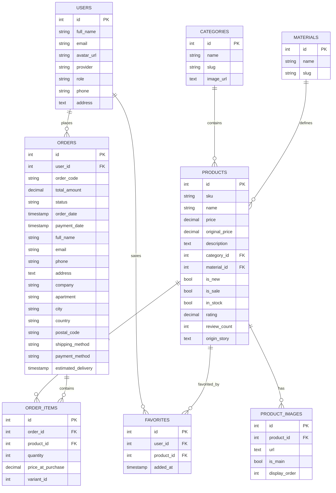

# Đề xuất Schema dữ liệu phù hợp với giao diện hiện tại

Tệp này trình bày các bảng dữ liệu nên dùng cho giao diện frontend hiện tại, bao gồm các bảng cốt lõi và quan hệ chính.

## 1. Sơ đồ bảng dữ liệu

## 2. Bảng chi tiết

### `Users`
| Trường | Kiểu | Mô tả |
|---|---|---|
| id | int | Khóa chính người dùng |
| full_name | string | Tên hiển thị |
| email | string | Email đăng nhập |
| avatar_url | text | Ảnh đại diện |
| provider | string | email hoặc google |
| role | string | customer hoặc admin |
| phone | string | Số điện thoại |
| address | text | Địa chỉ | 

### `Categories`
| Trường | Kiểu | Mô tả |
|---|---|---|
| id | int | Khóa chính |
| name | string | Tên danh mục |
| slug | string | Đường dẫn thân thiện |
| image_url | text | Ảnh đại diện danh mục |

### `Materials`
| Trường | Kiểu | Mô tả |
|---|---|---|
| id | int | Khóa chính |
| name | string | Tên chất liệu |
| slug | string | Định danh chất liệu |

### `Products`
| Trường | Kiểu | Mô tả |
|---|---|---|
| id | int | Khóa chính |
| sku | string | Mã sản phẩm |
| name | string | Tên sản phẩm |
| price | decimal | Giá hiện tại |
| original_price | decimal | Giá gốc để hiển thị giảm giá |
| description | text | Mô tả sản phẩm |
| category_id | int | Liên kết danh mục |
| material_id | int | Liên kết chất liệu |
| is_new | bool | Hàng mới |
| is_sale | bool | Sản phẩm giảm giá |
| in_stock | bool | Còn hàng hay hết hàng |
| rating | decimal | Điểm đánh giá trung bình |
| review_count | int | Số review |
| origin_story | text | Câu chuyện nguồn gốc |

### `ProductImages`
| Trường | Kiểu | Mô tả |
|---|---|---|
| id | int | Khóa chính |
| product_id | int | Liên kết sản phẩm |
| url | text | Đường dẫn ảnh |
| is_main | bool | Ảnh chính |
| display_order | int | Thứ tự hiển thị |

### `Orders`
| Trường | Kiểu | Mô tả |
|---|---|---|
| id | int | Khóa chính |
| user_id | int | Liên kết người dùng |
| order_code | string | Mã đơn hàng |
| total_amount | decimal | Tổng tiền |
| status | string | Trạng thái đơn |
| order_date | timestamp | Ngày đặt hàng |
| payment_date | timestamp | Ngày thanh toán |
| full_name | string | Tên người nhận |
| email | string | Email nhận |
| phone | string | SĐT nhận hàng |
| address | text | Địa chỉ giao hàng |
| company | string | Tên công ty |
| apartment | string | Căn hộ / tòa nhà |
| city | string | Thành phố |
| country | string | Quốc gia |
| postal_code | string | Mã bưu chính |
| shipping_method | string | Phương thức giao hàng |
| payment_method | string | Phương thức thanh toán |
| estimated_delivery | timestamp | Dự kiến giao hàng |

### `OrderItems`
| Trường | Kiểu | Mô tả |
|---|---|---|
| id | int | Khóa chính |
| order_id | int | Liên kết đơn hàng |
| product_id | int | Liên kết sản phẩm |
| quantity | int | Số lượng |
| price_at_purchase | decimal | Giá khi mua |
| variant_id | int | Mã biến thể size/color |

### `Favorites`
| Trường | Kiểu | Mô tả |
|---|---|---|
| id | int | Khóa chính |
| user_id | int | Liên kết người dùng |
| product_id | int | Liên kết sản phẩm |
| added_at | timestamp | Thời điểm thêm yêu thích |

## 3. Kết luận

Bảng chính cần vẽ ra để phù hợp với giao diện hiện tại là:
- `Users`
- `Categories`
- `Materials` (nếu cần lọc chất liệu)
- `Products`
- `ProductImages`
- `Orders`
- `OrderItems`
- `Favorites`

Các bảng này đủ để hỗ trợ sản phẩm, danh mục, giỏ hàng/đơn hàng, yêu thích và dữ liệu người dùng trên frontend hiện tại.
